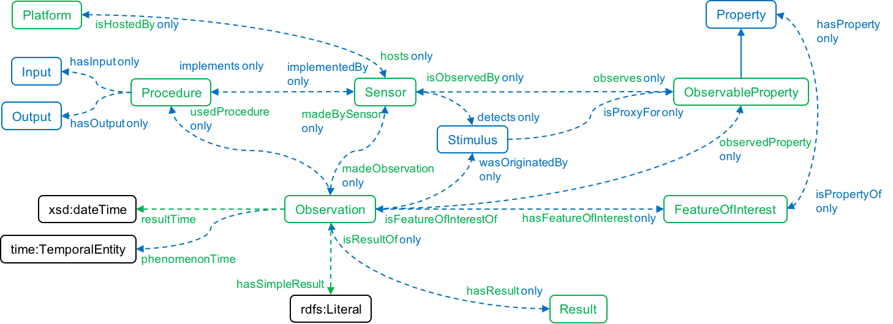

# Final Project: Web Semantic

## Description

The main goal of this project is to tranform plain text data with `.csv` extension to `.ttl` format to make queries using SPARQL via a web application.

The source data chosen correspond to samples of World Meteorological Organization (WMO) stations over France which take observation of different variables per day such as temperature, pressure, wind speed, etc. 

To downloaded, you can go to [METEO FRANCE - DONNÉES PUBLIQUES](https://donneespubliques.meteofrance.fr/?fond=produit&id_produit=90&id_rubrique=32), and select a date to get the data in format `.csv`.

## Data transformation from .csv to .ttl

### Note

In order to get the content of the file `/backend/src/main/resources/static/synop.2024.ttl` you should install git lfs (Large File System) because this file exceeds the maximum capacity to store a file on GitHub (it actually has all the triplets from january to november).

To do this, you should execute the following commands:
```
git lfs install
git lfs pull
```

After that, you should be able to see the whole file content.

## From .csv to .ttl conversion
(This step is already done and the .ttl file is stored under `/backend/src/main/resources/static/finalProject/backend/src/main/resources/static/synop.2024102509.ttl`)

To transform the original files from .csv to .ttl (extension used for represent knowledge graph according to RDF triples), we use [`tarql`](https://github.com/tarql/tarql).

Before try to transform, it must clone the tarql repo and follow the instruction descripted in the `README` file. More information available here https://tarql.github.io/.

Once configured, go to the root folder `tarql/`, created the folder `examples/`, and follow this steps:

1. Create a file `synop.sparql` in `/tarql/examples/` . In this file it is writted the constructor to create the RDF triples:

Note: In this file we are using the [SOSA ontology](https://www.w3.org/TR/vocab-ssn/) as prefix to describe the relationships between the csv columns. To create the triple, we follow the Observation axiomation.


```
PREFIX sosa: <http://www.w3.org/ns/sosa/>
PREFIX xsd: <http://www.w3.org/2001/XMLSchema#>
PREFIX ex: <http://example.org/station/>

CONSTRUCT {
  ?temperatureObservation a sosa:Observation;
    sosa:hasFeatureOfInterest ?ommStation;
    sosa:observedProperty ex:Temperature;
    sosa:hasSimpleResult ?temperature;
    sosa:resultTime ?dateTime .
  ?humidityObservation a sosa:Observation;
    sosa:hasFeatureOfInterest ?ommStation;
    sosa:observedProperty ex:Humidity;
    sosa:hasSimpleResult ?humidity;
    sosa:resultTime ?dateTime .
  ?pressureObservation a sosa:Observation;
    sosa:hasFeatureOfInterest ?ommStation;
    sosa:observedProperty ex:Pressure;
    sosa:hasSimpleResult ?pressure;
    sosa:resultTime ?dateTime .
  ?windSpeedObservation a sosa:Observation;
    sosa:hasFeatureOfInterest ?ommStation;
    sosa:observedProperty ex:WindSpeed;
    sosa:hasSimpleResult ?windSpeed;
    sosa:resultTime ?dateTime .
  ?horizontalVisibilityObservation a sosa:Observation;
    sosa:hasFeatureOfInterest ?ommStation;
    sosa:observedProperty ex:horizontalVisibility;
    sosa:hasSimpleResult ?horizontalVisibility;
    sosa:resultTime ?dateTime .
    
}
FROM<file:synop.202410.csv> 
WHERE {
  BIND (IRI(CONCAT("http://example.org/observation/temperature/", ?numer_sta, "-", ?date)) AS ?temperatureObservation)
  BIND (IRI(CONCAT("http://example.org/observation/humidity/", ?numer_sta, "-", ?date)) AS ?humidityObservation)
  BIND (IRI(CONCAT("http://example.org/observation/Pressure/", ?numer_sta, "-", ?date)) AS ?pressureObservation)
  BIND (IRI(CONCAT("http://example.org/observation/windSpeed/", ?numer_sta, "-", ?date)) AS ?windSpeedObservation)
  BIND (IRI(CONCAT("http://example.org/observation/horizontalVisibility/", ?numer_sta, "-", ?date)) AS ?horizontalVisibilityObservation)
  BIND (IRI(CONCAT("http://example.org/station/", CONCAT("omm_station_",?numer_sta))) AS ?ommStation)
  BIND (xsd:dateTime(STRDT(CONCAT(SUBSTR(?date, 1, 4), "-", SUBSTR(?date, 5, 2), "-", SUBSTR(?date, 7, 2), "T", 
                                  SUBSTR(?date, 9, 2), ":", SUBSTR(?date, 11, 2), ":", SUBSTR(?date, 13, 2)), xsd:dateTime)) AS ?dateTime)
  BIND (xsd:float(?t) AS ?temperature)
  BIND (xsd:int(?u) AS ?humidity)
  BIND (xsd:int(?pmer) AS ?pressure)
  BIND (xsd:float(?ff) AS ?windSpeed)
  BIND (xsd:float(?vv) AS ?horizontalVisibility)
}
```
2. Copy the .csv file downloaded into `/tarql/examples` folder. **Note that the name of the .csv file must be the same written in the `synop.sparql` at the line FROM<file:xxxx.csv>**, in this example, the file has the name `synop.202410.csv`.

3. Go to the folder `tarql/target/appassembler/bin`.

4. Execute the following command:
```
./tarql --delimiter ";" ./../../../examples/synop.sparql
```

You will see an output like this with n triplets:
```
<http://example.org/observation/Pressure/89642-20241031210000>
        rdf:type                   sosa:Observation ;
        sosa:hasFeatureOfInterest  ex:omm_station_89642 ;
        sosa:observedProperty      ex:Pressure ;
        sosa:hasSimpleResult       "98570"^^xsd:int ;
        sosa:resultTime            "2024-10-31T21:00:00"^^xsd:dateTime .

<http://example.org/observation/windSpeed/89642-20241031210000>
        rdf:type                   sosa:Observation ;
        sosa:hasFeatureOfInterest  ex:omm_station_89642 ;
        sosa:observedProperty      ex:WindSpeed ;
        sosa:hasSimpleResult       "5.100000"^^xsd:float ;
        sosa:resultTime            "2024-10-31T21:00:00"^^xsd:dateTime .

<http://example.org/observation/horizontalVisibility/89642-20241031210000>
        rdf:type                   sosa:Observation ;
        sosa:hasFeatureOfInterest  ex:omm_station_89642 ;
        sosa:observedProperty      ex:horizontalVisibility ;
        sosa:hasSimpleResult       "18000"^^xsd:float ;
        sosa:resultTime            "2024-10-31T21:00:00"^^xsd:dateTime .
.
.
.
```
Optionally, to save the output in format `.ttl`, you can use this command:
```
./tarql --delimiter ";" ./../../../examples/synop.sparql > ./../../../examples/synop.202410.ttl
```

The result file `.ttl` is actually the RDF graph which SPARQL uses to make queries and retrieve data.

## Backend

### Technological stack

- Java web SpringBoot application.
- Apache Jena Fuseki.

### How to execute ?

```
cd backend/
mvn clean install (just for the first time)
mvn exec:java
```

It is basically a Java Web application exposing the `http:localhost:8080` url. It has the basic endpoints to call from the frontend to respond to SPARQL queries.

This web app embed an Apache Jena Fuseki server, and run it in http://localhost:3030. The user can download the RDF file just going to localhost:3030/rdf-data/. This will download a `.trig` file which actually contains the RDF triplets.

### Endpoints

1. `POST localhost:8080/sparql/customQuery`
```
{
    "userQuery": "SELECT ?s ?o ?p FROM<http://example.org/dataset> WHERE{ ?s ?o ?p} LIMIT 1"
}
```

Another query example:
```
{
    "userQuery": "PREFIX ex:<http://example.org/station/> 
PREFIX sosa:<http://www.w3.org/ns/sosa/>
SELECT ?observedProperty ?result ?resultTime
FROM<http://example.org/dataset>
WHERE{ ?observation a sosa:Observation ; sosa:hasFeatureOfInterest ex:omm_station_07005 ; sosa:observedProperty ?observedProperty ; sosa:hasSimpleResult ?result ; sosa:resultTime ?resultTime FILTER ( ( ?observedProperty = ex:Temperature ) || ( ?observedProperty = ex:Humidity ) ) } ORDER BY ?resultTime"
}
```
2. `POST http://localhost:8080/sparql/queryPerDay`
```
{
    "stationId": "07005",
    "attributes": ["Temperature", "Humidity", "Pressure"],
     "dateTime": "2024-01-01T00:00:00"
}
```

3. `POST http://localhost:8080/sparqlv2/queryPerMonth`
```
{
  {
    "stationId": "07005",
    "attributes": ["Temperature", "Humidity", "Pressure"],
    "dateTime": "2024-10"
}
}
```

4. `POST http://localhost:8080/sparqlv2/querySortedBy`
```
{
  {
    "type": "ascend",
    "lenght": 3,
    "attribute": "Temperature"
}
}
```

## Frontend

### Technological stack

- React Native Web Application.

### How to execute ?

```
npm install (just for the first time)
npm start
```